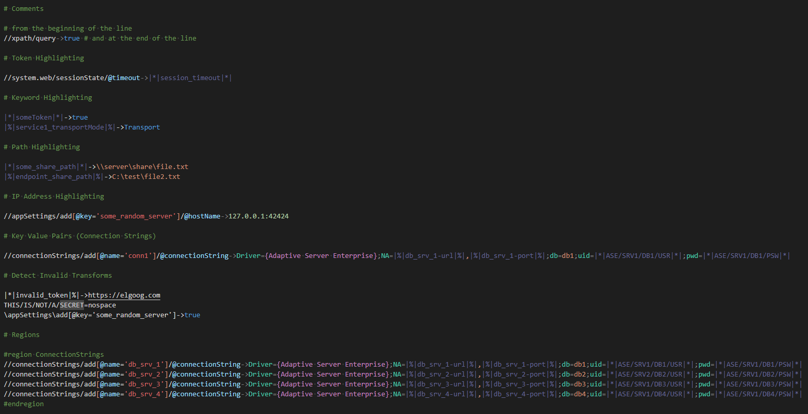

# xpath README

A Visual Studio Code extension to enable some syntax highlighting when working with AppConfig repos.

## Features



- Syntax highlighting for AppConfig environment configuration files
  - `*.set.xpath.txt`
  - `*.tokens.properties`
  - `*.endpoints`
- Supports endpoint tokens (`|%|...|%|`) (cloud-only)
- Adds region support
- Comment highlighting
- Keyword highlighting
  - `true`, `false`, `Transport`, `null`, `None`, `ON`, `YES`, etc.
- IP Address Highlighting
- Path highlighting
  - For rooted Windows and UNC paths
- Automatic word wrap for endpoints, tokens, and secret files
- Default file encoding `UTF8`
- Default line ending to Unix (`\n`)
- Auto-removes trailing whitespace

## Installation

1. Clone this repo
2. Copy it to your VSCode extensions folder

The default location of the extensions folder is:

`C:\Users\%USERNAME%\.vscode\extensions`

So, if your username was `treyc` then you would copy this folder to:

`C:\Users\treyc\.vscode\extensions`

## Extension Settings

### Defaults

```json
"[xpathv2]": {
    "files.encoding": "utf8",
    "files.eol": "\n",
    "files.trimTrailingWhitespace": true,
    "diffEditor.ignoreTrimWhitespace": false,
    "editor.wordWrap": "off",
    "editor.quickSuggestions": {
        "comments": "off",
        "strings": "on",
        "other": "on"
    }
}
```

## Known Issues

- None

---

## For Developers

This folder contains all of the files necessary for the XPath extension.

- `package.json` - this is the manifest file in which you declare your language support and define the location of the grammar file that has been copied into your extension.
- `syntaxes/xpath.tmLanguage.json` - this is the Text mate grammar file that is used for tokenization.
- `language-configuration.json` - this is the language configuration, defining the tokens that are used for comments and brackets.

### Get up and running straight away

- Make sure the language configuration settings in `language-configuration.json` are accurate.
- Press `F5` to open a new window with your extension loaded.
- Create a new file with a file name suffix matching your language.
- Verify that syntax highlighting works and that the language configuration settings are working.

### Make changes

- You can relaunch the extension from the debug toolbar after making changes to the files listed above.
- You can also reload (`Ctrl+R` or `Cmd+R` on Mac) the VS Code window with your extension to load your changes.

### Add more language features

- To add features such as IntelliSense, hovers and validators check out the VS Code extenders documentation at https://code.visualstudio.com/docs

### Install your extension

- To start using your extension with Visual Studio Code copy it into the `<user home>/.vscode/extensions` folder and restart Code.
- To share your extension with the world, read on https://code.visualstudio.com/docs about publishing an extension.

---

## Release Notes

### 0.0.1

Initial release.

### 1.0.1

Huge rewrite. Added support for secrets, multi-token values in xpath, key-value pair highlighting, extended keywords, added path highlighting, constants highlighting, and more.
